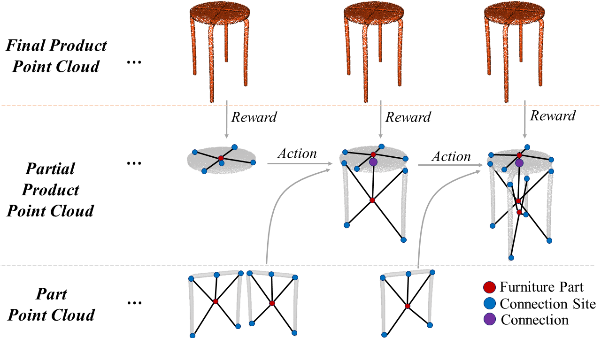

# AssembleRL: Learning to Assemble Furniture from Their Point Clouds
Implementation of the IROS 2022 paper AssembleRL: Learning to Assemble Furniture from Their Point Clouds.  
Özgür Aslan, Burak Bolat, Batuhan Bal, Tuğba Tümer, Sinan Kalkan and Erol Şahin  



We propose to use only the fully assembled point cloud of the furniture
and the mesh models of its parts, to learn the assembly plan. Specifically, we introduce a novel reward function that evaluates the match between the point cloud of the partially assembled furniture against its fully assembled view using two measures that evaluate the *incorrectness* and *incompleteness*. We train a graph-convolutional neural network with our novel reward signal, combining the incorrectness and incompleteness measures, to learn the assembly plan as a policy that predicts which part pairs need to be connected via which of their connections. 

## Dependencies
- pytorch
- pytorch-geometric
- open3d
- stable-baselines3
- gym
- numpy
- networkx

## File Structure
```
assembly_learning
│
│─── envs
│    │─── asc_base.py
│    │─── asc_features.py
│    │─── asc_supervised.py
│
│─── objects
│
│─── utils
│    │─── graph.py
│    │─── pointcloud.py
│    │─── pointnet2_utils.py
│    │─── pointnet2.py
│    │─── reg_reward.py
│    │─── transform_utils.py
│

```
## References

The assembly learning environment includes:
- Point cloud manipulation and ICP using open3d: https://github.com/isl-org/Open3D
- Furniture objects and transform utilities (slightly modified) from IKEA Furniture Assembly Environment: https://github.com/clvrai/furniture
- Pointnet++ and GCN implementations with pytorch-geometric: https://github.com/pyg-team/pytorch_geometric 
- RL agent implementation and training using stable-baselines3: https://github.com/DLR-RM/stable-baselines3 