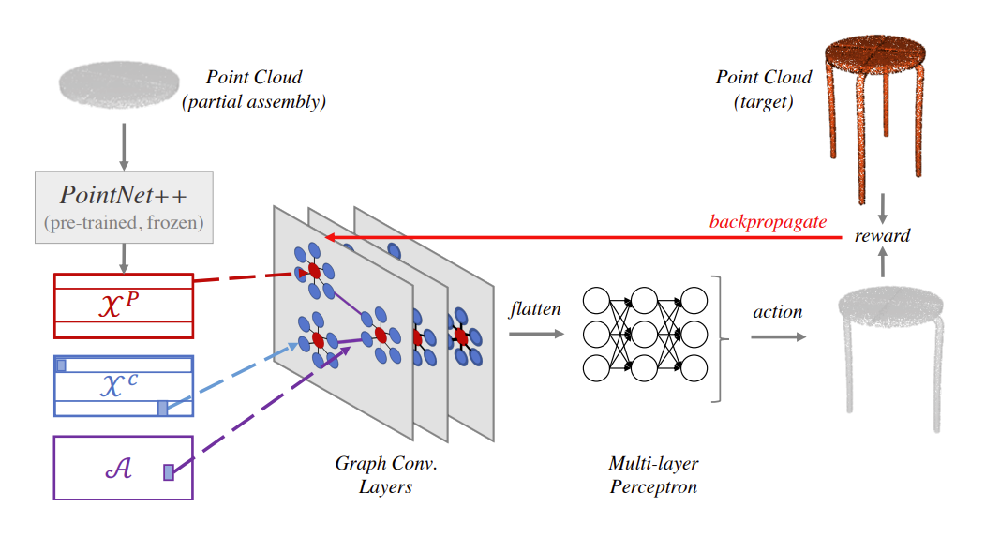
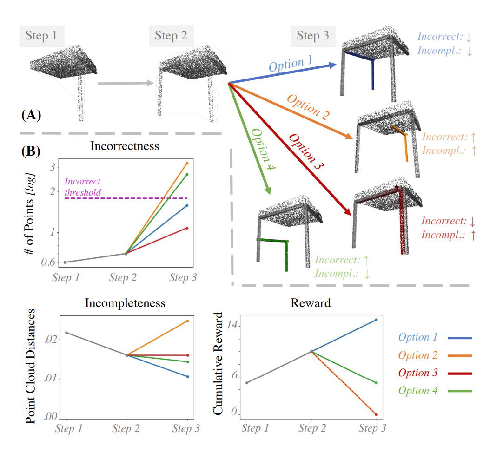
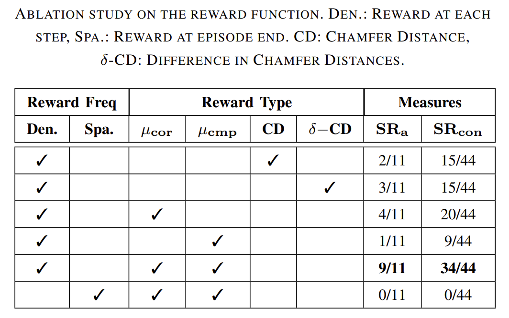

## AssembleRL: Learning to Assemble Furniture from Their Point Clouds
Özgür Aslan, Burak Bolat, Batuhan Bal, Tuğba Tümer, Erol Şahin, and Sinan Kalkan

### Abstract
The rise of simulation environments has enabled learning-based approaches for assembly planning, which is otherwise a labor-intensive and daunting task. Assembling furniture is especially interesting since furniture are intricate and pose challenges for learning-based approaches. Surprisingly, humans can solve furniture assembly mostly given a 2D snapshot of the assembled product. Although recent years have witnessed promising learning-based approaches for furniture assembly, they assume the availability of correct connection labels for each assembly step, which are expensive to obtain in practice. In this paper, we alleviate this assumption and aim to solve furniture assembly with as little human expertise and supervision as possible. To be specific, we assume the availability of the assembled point cloud, and comparing the point cloud of the current assembly and the point cloud of the target product, obtain a novel reward signal based on two measures: Incorrectness and incompleteness. We show that our novel reward signal can train a deep network to successfully assemble different types of furniture. 

### Network Architecture

An overview of the system is depicted. Point cloud of the current assembly is processed by graph-convolutional layers followed by fully connected layers. The selected action is rewarded by comparing the updated assembly with the target assembly.

### Incompleteness and Incorrectness Measures

An illustration showing how the proposed measures and the reward values change over time. (a) Assembly of a table with three steps. (b) How different assembly actions affect the measures.

### Quantitative Results

### Acknowledgements
